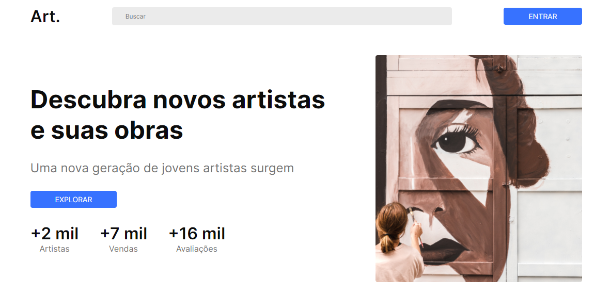

# Art.

## desafio26-codelandia

#### Este é o desafio _26_ da comunidade _Codelândia_ por [iuricode](https://github.com/iuricode)!

<h4 align="center"><a href="https://desafio26-codelandia.vercel.app/">Clique para visitar o projeto</a></h4>

## 🎯 Objetivo

O desafio consiste em desenvolver landing page de acordo com o layout disponibilizado no [Figma](https://www.figma.com/file/Yb9IBH56g7T1hdIyZ3BMNO/Desafios---Codelândia?node-id=94211%3A1216).

## 🛠️ Tecnologias utilizadas

Para o desenvolvimento deste site utilizei as seguintes tecnologias:

- HTML;
- SASS;
